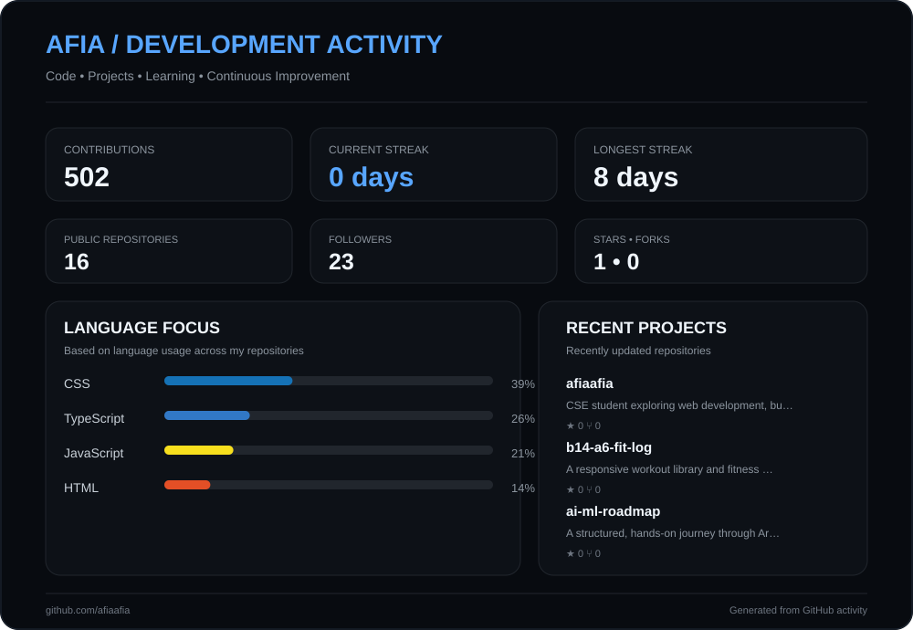
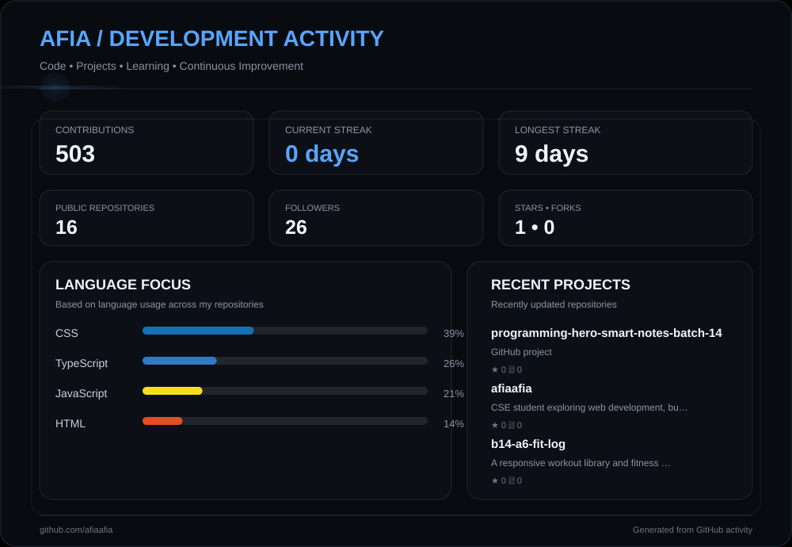

  

  

## Hi, I'm Afia Mubassira 👋

🇧🇩 CSE Student • Learning Web Development

I learn by building, experimenting, and turning ideas
into clean and functional web experiences.

**Tech:** HTML • CSS • JavaScript • TypeScript • React • Next.js
**Exploring:** Backend • APIs • Full-Stack Development

---

## ⚙️ Tech Stack

### 🖥️ Languages

  

### ⚛️ Frameworks & Libraries

  

### 🗄️ Backend & Database

  

### ⚡ Tools & Platforms

  

---

## 📂 Projects

- [B14-A6-Fit-Log](https://github.com/afiaafia/b14-a6-fit-log)
- [Dev Stack Builder V2](https://github.com/afiaafia/dev-stack-builder-v2)
- [restaurant-menu-a](https://github.com/afiaafia/restaurant-menu-a)

---

## 📊 GitHub Activity

  

---
## 📊 GitHub Activity

  

---

## GitHub Streaks:

---

## GitHub Contributions:

---

## 🔗 Connect with me

  

    
    
    
    
  

---

 
 

 
  Thanks for being here — hope you found something worth exploring. 💫  

<!-- 📊 Profile Views Counter -->

  

